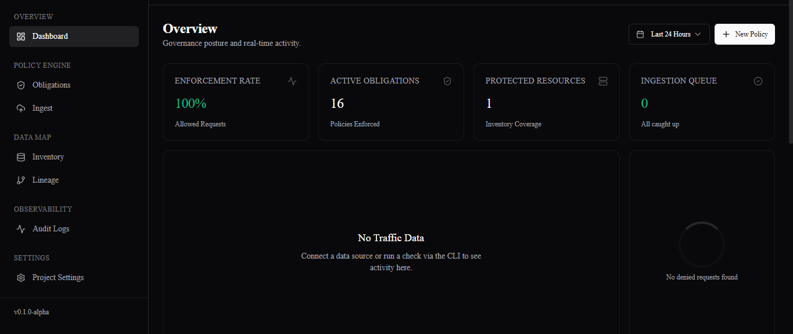
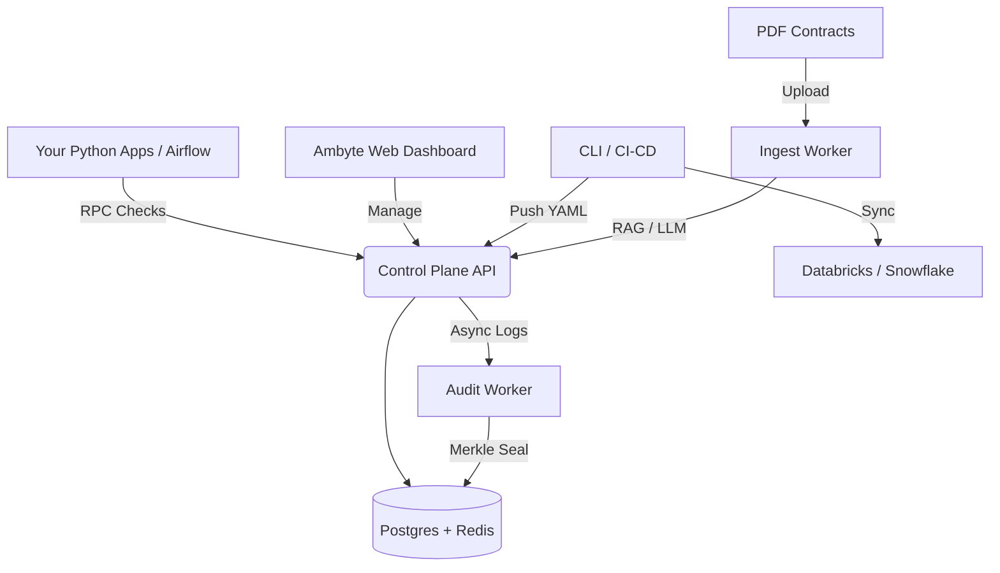

<div align="center">
  <picture>
    <source media="(prefers-color-scheme: dark)" srcset="https://via.placeholder.com/600x150/09090b/ffffff?text=Ambyte+Logo+(Dark)">
    <source media="(prefers-color-scheme: light)" srcset="https://via.placeholder.com/600x150/ffffff/000000?text=Ambyte+Logo+(Light)">
    
  </picture>
  
  <p><strong>Turn legal obligations into machine-enforceable data policies.</strong></p>
</div>

<div align="center">
  <a href="https://github.com/ambyte-ai/ambyte"></a>
  <a href="https://pypi.org/project/ambyte-sdk"></a>
  <a href="https://hub.docker.com/u/ambyte"></a>
</div>

<br/>

**Ambyte** is a 100% self-hosted Compliance-as-Code platform for modern data and AI teams. It reads your legal contracts (DPAs, MSAs), extracts the constraints using AI, resolves conflicts, and automatically compiles them into executable policies for Snowflake, Databricks, AWS IAM, and Python applications. **Auth and Postgres built in!**

If you want enterprise-grade data governance, cryptographically sealed audit logs, and compliance threat mapping—without sending your sensitive metadata to a SaaS vendor—this is it.

 [Architecture](#-architecture)

---

# 🚀 Quickstart

Ambyte is designed to run entirely within your VPC. The easiest way to start is using Docker Compose to spin up the Control Plane, and our CLI to interact with it.

### 1. Spin up the Control Plane (Backend, UI, Database, Vector Store)

> You need to configure your Clerk Auth to access the local UI:
```
# API Endpoints (Point to your local docker-compose services)
NEXT_PUBLIC_API_URL=http://localhost:8000/v1
NEXT_PUBLIC_INGEST_API_URL=http://localhost:8001

# Clerk Next.js Authentication Keys
# Get from: https://dashboard.clerk.com -> API Keys
NEXT_PUBLIC_CLERK_PUBLISHABLE_KEY=pk_test_your_publishable_key
CLERK_SECRET_KEY=sk_test_your_secret_key
```

Check the `.env.example` file for more information on all environment variables needed for the dashboard.

```bash
git clone https://github.com/ambyte-ai/ambyte.git
cd ambyte

# Boot the platform (Control Plane API, Next.js Dashboard, Postgres, Redis, Qdrant)
docker compose up -d

# Initialize the database and get your Root API Key
docker compose exec api python src/scripts/init_db.py
```

### 2. Install the CLI & SDK
```bash
pip install ambyte
```

### 3. Connect your Workspace
```bash
ambyte login  # Paste your generated Root API Key
ambyte init   # Scaffold your local policy workspace
```

<br/>

# 💻 Developer Experience (DX)

Once configured, enforcing compliance in your Python applications or Airflow pipelines requires just one line of code.

```python
import ambyte
from ambyte import guard, trace

# Initialize the SDK (Reads AMBYTE_API_KEY from environment)
ambyte.init()

# 1. Block unauthorized access based on purpose limitation or geofencing
@guard(resource="urn:snowflake:prod:sales_data", action="read", context={"purpose": "marketing"})
def fetch_sales_data():
    return db.query("SELECT * FROM sales_data")

# 2. Automatically trace data lineage and AI training runs
with trace(name="train_churn_model", inputs=["urn:snowflake:prod:sales_data"]):
    model = train_model(fetch_sales_data())
```

<br/>

# ✨ Core Capabilities

### 🤖 AI Contract Ingestion
Drop a PDF into the dashboard. Ambyte uses an AI pipeline (VoyageAI + GPT) to extract defined terms, map them to regulatory frameworks (GDPR, AI Act), and generate YAML obligations automatically. 

### 🛡️ Universal Policy Compiler
Write policies once in YAML, enforce them everywhere. Ambyte resolves conflicting rules (e.g., *Contract A says delete in 5 years, GDPR says 2 years*) and compiles them into:
* **Snowflake:** Dynamic Masking & Row Access Policies
* **Databricks:** Unity Catalog UDFs
* **AWS IAM:** S3 Resource Policies & Guardrails
* **OPA / Rego:** Data bundles
* **Python:** Local JSON bundles for sub-millisecond SDK evaluation

### 🕸️ Compliance Threat Map
A highly interactive React Flow canvas that tracks Data Lineage. Instantly visually trace "Poison Pills" (e.g., data that explicitly forbids AI training) as they propagate downstream into your machine learning models.

### 🔐 Cryptographic Audit Ledger
Every decision the engine makes is recorded, hashed, and sealed into immutable Merkle Trees signed with an Ed25519 key. You can mathematically prove to auditors that a log entry was never tampered with.
```bash
ambyte audit verify <log-id>
```

<br/>

# 🔒 100% Air-Gapped & Privacy First

Ambyte is built differently from other data governance tools. 

* **Your Data Stays Local:** Connectors run locally on your machines and only push *metadata tags* (not row data) to the Control Plane.
* **No Vendor Lock-in:** Policies compile down to native SQL or JSON. If you turn Ambyte off, your Snowflake Masking Policies and AWS IAM rules keep working.
* **Enterprise Ready:** Full RBAC, SSO (via Clerk OIDC), and stateless high-throughput architecture.

<br/>

# 🏗️ Architecture



* **Control Plane API (FastAPI):** Central hub for resolving policies and answering SDK `check` requests.
* **Web UI (Next.js):** Dashboard for KPI tracking, lineage visualization, and team management.
* **Ingest Worker (ARQ):** Asynchronous document processing using unstructured, Qdrant, and OpenAI/VoyageAI.
* **Audit Worker:** High-throughput Redis-stream consumer that cryptographically seals logs.
* **Connectors:** CLI-driven tools that crawl your data warehouses to build a unified inventory.

<br/>

# 📚 Documentation & Guides

<details>
<summary><b>How does Conflict Resolution work?</b></summary>
If multiple contracts apply to the same dataset, Ambyte's Rules Engine resolves conflicts mathematically before compiling the policy. For example: retention rules select the <i>shortest</i> duration (Data Minimization), while geofencing rules calculate the <i>intersection</i> of allowed regions.
</details>

<details>
<summary><b>Can I run the Policy Compiler in CI/CD?</b></summary>
Yes! The Ambyte CLI is designed for GitOps. You can run <code>ambyte build</code> in GitHub Actions to generate Snowflake SQL files, and use Terraform/Flyway to apply them, treating Ambyte purely as a logic engine.
</details>

<details>
<summary><b>How do I use the Databricks Unity Catalog Connector?</b></summary>
Install `ambyte-databricks` where you have access to your workspace. Run `ambyte-databricks inventory sync` to pull your catalog into Ambyte. Then run `ambyte-databricks policy enforce` to generate and apply masking functions directly to Unity Catalog. The Databricks connector is the first of many connectors we plan to release.
</details>

# 🤝 Contributing

We welcome contributions from the community! Whether you want to add a new connector, improve the AI extraction prompts, or fix a bug in the UI:

1. Read our [Contributing Guide](CONTRIBUTING.md).
2. Set up your local dev environment using `uv`.
3. Submit a Pull Request!

<div align="center">
  <p>Built with ❤️ by a legal technologist, for data engineers.</p>
</div>